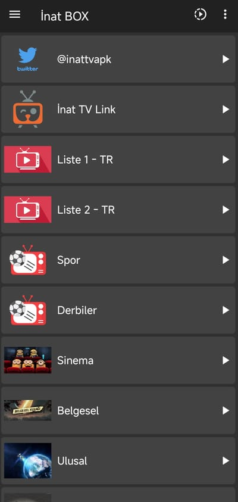
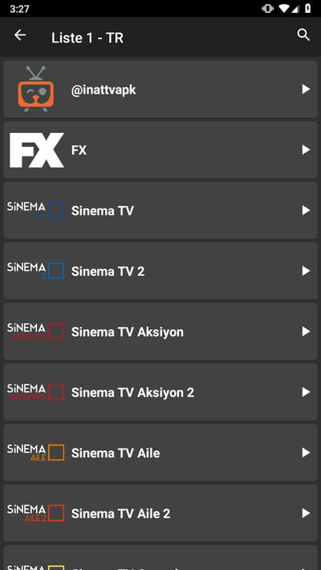

# İnat BOX v16 APK İndir: Android ve Android TV Kurulum Rehberi

İnat TV tarafından geliştirilen İnat BOX’ın güncel Android kurulum dosyasını bu depodan doğrudan indirebilir, dosya bilgilerini kontrol edebilir ve kurulum adımlarını takip edebilirsiniz. Bu sayfadaki indirme bağlantısı başka bir dosya barındırma servisine değil, `inattv-ops/inatbox` deposunda bulunan sürüm 16 APK dosyasına gider.

> **Güncel sürüm:** İnat BOX 16.0
>
> **Dosya adı:** `inat-box-v16.apk`
>
> **Minimum Android sürümü:** Android 6.0 (API 23)

## İnat BOX v16 indir

### [İnat BOX v16 APK dosyasını indir](https://github.com/inattv-ops/inatbox/releases/download/v16.0/inat-box-v16.apk)

İndirme başlamazsa bağlantıya uzun basıp bağlantıyı tarayıcıda açmayı veya masaüstünde bağlantıya sağ tıklayıp dosyayı kaydetmeyi deneyebilirsiniz.

## İnat BOX v16 dosya bilgileri

| Bilgi | Değer |
|---|---|
| Uygulama adı | İnat BOX |
| Sürüm adı | 16.0 |
| Sürüm kodu | 16 |
| Paket kimliği | `com.bp.box` |
| Dosya adı | `inat-box-v16.apk` |
| Dosya boyutu | 22.464.949 bayt (yaklaşık 21,42 MiB) |
| Minimum Android | Android 6.0 / API 23 |
| Yerel işlemci mimarileri | `arm64-v8a`, `armeabi-v7a`, `x86`, `x86_64` |
| SHA-256 | `B59D3E0925B498DF32EAE9288216BF6EFC2EB0C4A3A2CB63CAAC9211015A346E` |
| İmza sertifikası SHA-256 | `7CC771973665660F0653FCE2E9490E48B92BE8432A88D74F91703A716F6B4692` |

Bu bilgiler, depoya eklenen APK ile uygulamanın sürüm yapılandırması karşılaştırılarak hazırlanmıştır. Dosya adı veya hash değeri farklı olan bir paket, bu depoda yayımlanan dosyayla birebir aynı değildir.

## İnat BOX nedir?

İnat BOX, İnat TV tarafından Android tabanlı cihazlar için hazırlanan bir medya uygulamasıdır. “İnat TV” geliştirici ve yayın adı, “İnat BOX” ise bu depoda sunulan Android paketinin adıdır; bu nedenle İnat TV aramaları da bu pakete çıkar. Uygulamanın yapılandırmasında hem standart Android başlatıcısı hem de Android TV cihazlarında kullanılan Leanback başlatıcısı yer alır. Dokunmatik ekran zorunlu tutulmadığı için televizyon ve TV kutusu türündeki cihazlar da uygulamanın hedeflediği kullanım biçimleri arasındadır.

Sürüm 16 paketi telefon, tablet ve Android TV tabanlı cihazlara kurulabilecek tek bir APK olarak sunulur. Bununla birlikte cihaz üreticisinin Android üzerinde yaptığı değişiklikler, kullanılabilir depolama alanı ve güvenlik politikaları kurulum sonucunu etkileyebilir. Minimum Android sürümünü karşılamak her cihazda aynı performansın garanti edildiği anlamına gelmez.

## Uygulama ekranları

Aşağıdaki görüntüler İnat BOX v16.0 uygulamasından alınmıştır. Yalnızca bu sayfaya sığması için ölçeklendirilmiştir; kırpılmamış ve içerikleri değiştirilmemiştir.

| Ana ekran | Sol menü | Dikey oynatıcı | TV listesi |
| :---: | :---: | :---: | :---: |
|  |  |  |  |

## Sürüm 16 hakkında doğrulanmış teknik bilgiler

İnat BOX v16 kaynak yapılandırmasında sürüm adı `16.0`, sürüm kodu `16` ve minimum Android seviyesi API 23 olarak tanımlıdır. Paket, yayın tipi bir derleme olarak hazırlanmıştır; hata ayıklama özelliği kapalıdır ve kod/kaynak küçültme ayarları etkindir.

Kaynak projedeki v16 notları, Android 6 gibi eski sistemlerde yeni Java API’lerinden kaynaklanabilecek uyumluluk sorunlarına karşı çekirdek kitaplık uyumluluğu düzenlemeleri yapıldığını gösterir. Uygulama ayrıca telefon ve televizyon arayüzleri için gerekli başlatıcı tanımlarını, ağ bağlantısı kontrolünü, bildirim altyapısını ve uygulama içi oynatıcı yapılandırmasını içerir.

Bu sayfa yalnızca doğrulanabilen yapılandırma bilgilerini aktarır. Kanal sayısı, belirli bir içerik kataloğu, çözünürlük, kesintisiz yayın veya her cihazda sorunsuz çalışma gibi değişken ve doğrulanmamış vaatlerde bulunmaz.

## APK dosyasının SHA-256 değeri nasıl doğrulanır?

SHA-256 kontrolü, indirdiğiniz dosyanın bu depoda yayımlanan dosyayla aynı olup olmadığını anlamanızı sağlar. Hash eşleşmesi dosya bütünlüğünü doğrular; tek başına bir güvenlik veya zararlı yazılım garantisi değildir.

### Windows

PowerShell’i APK’nın bulunduğu klasörde açıp şu komutu çalıştırın:

```powershell
Get-FileHash .\inat-box-v16.apk -Algorithm SHA256
```

### Linux

```bash
sha256sum inat-box-v16.apk
```

### macOS

```bash
shasum -a 256 inat-box-v16.apk
```

Komutun verdiği sonuç şu değerle aynı olmalıdır:

```text
B59D3E0925B498DF32EAE9288216BF6EFC2EB0C4A3A2CB63CAAC9211015A346E
```

Sonuç farklıysa dosyayı kurmayın; dosyayı silip bu sayfadaki doğrudan bağlantıdan yeniden indirin.

APK, Android SDK `apksigner` aracıyla doğrulanmıştır. Paket hem JAR imzası (v1) hem de APK Signature Scheme v2 doğrulamasından geçer ve tek imzalayıcı içerir. İmza sertifikasının SHA-256 parmak izi yukarıdaki tabloda yer alır.

## Android telefona veya tablete İnat BOX nasıl kurulur?

1. Yukarıdaki **İnat BOX v16 APK dosyasını indir** bağlantısını açın.
2. İndirme tamamlandıktan sonra tarayıcınızın indirmeler bölümünden `inat-box-v16.apk` dosyasını seçin.
3. Android, bu kaynaktan ilk kez APK kuruyorsanız tarayıcıya veya dosya yöneticisine kurulum izni vermenizi isteyebilir.
4. Yalnızca APK’yı açtığınız uygulama için geçici izin verin ve kurulum ekranındaki paket adını kontrol edin.
5. Kurulum tamamlandığında verdiğiniz “bilinmeyen uygulama yükleme” iznini tekrar kapatabilirsiniz.

Menü adları Android sürümüne ve telefon üreticisine göre değişebilir. Güvenlik korumalarını genel olarak kapatmak yerine yalnızca kullandığınız güvenilir dosya yöneticisine geçici izin vermek daha kontrollü bir yöntemdir.

## Android TV veya TV Box üzerine kurulum

Android TV cihazlarında APK kurulumu için dosyanın cihaza aktarılması gerekir. USB bellek, yerel ağ üzerinden dosya aktarımı veya cihazdaki bir tarayıcı kullanılabilir.

1. `inat-box-v16.apk` dosyasını Android TV veya TV Box cihazına aktarın.
2. Dosyanın boyutunu ve mümkünse SHA-256 değerini kontrol edin.
3. Cihaz ayarlarında APK’yı açacak dosya yöneticisine kurulum izni verin.
4. Dosyayı açın ve Android’in gösterdiği kurulum bilgilerini inceleyin.
5. Kurulum bittikten sonra geçici kurulum iznini kapatın.

Bazı televizyon üreticileri standart Android TV yerine farklı bir işletim sistemi kullanır. APK dosyaları yalnızca Android tabanlı sistemlerde çalışır; Tizen, webOS veya Android olmayan başka platformlara doğrudan kurulamaz.

## Önceki sürümden v16’ya güncelleme

Cihazda aynı paket kimliği ve uyumlu imza ile kurulmuş eski bir İnat BOX sürümü varsa Android normal bir güncelleme ekranı gösterebilir. “Uygulama yüklenemedi” veya imza uyuşmazlığı hatası görülürse mevcut uygulamayı hemen kaldırmadan önce uygulama verilerinin kaybolabileceğini dikkate alın.

Güncelleme sırasında:

- En az APK boyutundan daha fazla boş depolama alanı bırakın.
- Yarım kalmış eski indirmeyi silip dosyayı yeniden indirin.
- Dosya adının `inat-box-v16.apk` olduğunu kontrol edin.
- Hash değerini bu sayfadaki SHA-256 ile karşılaştırın.
- Kurulu paket farklı bir kaynaktan geldiyse imza uyumsuzluğu yaşanabileceğini unutmayın.

## Uygulamanın bildirdiği izinler ve üçüncü taraf bileşenleri

İnat BOX v16’nın kendi manifestinde internet erişimi, ağ durumunu okuma, cihaz açılışını algılama, bildirim gönderme, titreşim ve paket kurulum isteği izinleri tanımlıdır. Nihai APK’nın birleşik manifestinde kullanılan Firebase ve reklam kitaplıkları nedeniyle uyanık tutma, ön plan hizmeti, Wi-Fi durumu, Firebase mesaj alımı, reklam kimliği, Privacy Sandbox reklam hizmetleri, Install Referrer bağlantısı ve uygulamaya özel dinamik alıcı koruması bildirimleri de bulunur.

Bir iznin APK manifestinde bulunması, her Android sürümünde otomatik verildiği veya her kullanımda etkin olduğu anlamına gelmez. Android sürümüne bağlı olarak bazı izinler kurulum sırasında, bazılarıysa ilgili özellik kullanılırken gösterilebilir.

Kaynak proje ayrıca Firebase Analytics, Firebase Crashlytics, Firebase Cloud Messaging, Unity Ads ve Start.io bileşenlerini içerir. Bu bileşenler analiz, hata raporlama, bildirim veya reklam gösterimi kapsamında teknik veriler işleyebilir. Bu nedenle “hiç veri toplanmaz” ya da “uygulama tamamen reklamsızdır” gibi kesin ifadeler bu sayfada kullanılmamaktadır.

## Sık karşılaşılan kurulum sorunları

### İndirme bağlantısı açılmıyor

Tarayıcıdaki içerik engelleyiciyi geçici olarak kontrol edin, farklı bir ağ deneyin veya bağlantıyı yeni sekmede açın. Dosya GitHub üzerinden sunulur; GitHub’a erişilemeyen bir ağda indirme de başlamayabilir.

### Paket ayrıştırılırken sorun oluştu

Bu hata eksik indirme, bozuk dosya veya desteklenmeyen Android sürümüyle ilişkili olabilir. Dosya boyutunu ve SHA-256 değerini kontrol edin. İnat BOX v16 en az Android 6.0 gerektirir.

### Uygulama yüklenemedi

Cihazda yeterli alan bulunduğundan emin olun. Aynı paket kimliğine sahip fakat farklı imzalanmış bir uygulama varsa Android güncellemeyi reddedebilir. Mevcut uygulamayı kaldırmak yerel verileri silebileceğinden karar vermeden önce bunu göz önünde bulundurun.

### Android TV ana ekranında görünmüyor

Cihazı yeniden başlatın ve uygulamalar listesini kontrol edin. Üreticinin özel başlatıcısı üçüncü taraf uygulamaları farklı bir bölümde gösterebilir.

## Resmî bağlantılar ve iletişim

- İnat TV resmî web sitesi: [inatvapp.com](https://inatvapp.com/)
- GitHub hesabı: [inattv-ops](https://github.com/inattv-ops)
- X hesabı: [@inattvapk](https://x.com/inattvapk)
- E-posta: **inattvapk@gmail.com**

Eski alan adları veya farklı GitHub hesapları üzerinden sunulan dosyalar bu depodaki APK ile aynı olmayabilir. Dosya karşılaştırması için sürüm, boyut ve SHA-256 bilgilerini birlikte kullanın.

## Sık sorulan sorular

### İnat BOX’ın en güncel dosyası hangisi?

Bu depoda yayımlanan güncel dosya `inat-box-v16.apk`, sürüm adı ise 16.0’dır.

### İnat BOX v16 hangi Android sürümünü ister?

Kaynak yapılandırmada minimum seviye Android 6.0, yani API 23 olarak belirtilmiştir.

### APK dosyası güvenli mi?

Bu sayfadaki SHA-256 değeri dosyanın bütünlüğünü kontrol etmeye yarar, ancak tek başına “virüssüz” veya mutlak güvenli olduğu sonucunu vermez. Dosyayı yalnızca belirtilen resmî bağlantılardan indirin, hash kontrolü yapın ve cihazınızın güvenlik uyarılarını inceleyin.

### İnat BOX iPhone veya iPad’e kurulabilir mi?

Hayır. Buradaki dosya Android APK paketidir ve iOS/iPadOS üzerine kurulamaz.

### Dosyayı bilgisayara kurabilir miyim?

APK, Windows veya macOS için yerel bir kurulum paketi değildir. Bu sayfa bilgisayarda çalıştırma ya da emülatör uyumluluğu garantisi vermez.

## Kullanım ve içerik hakları

Uygulamayı ve eriştiğiniz içerikleri bulunduğunuz ülkedeki mevzuata, hizmet koşullarına ve içerik sahiplerinin haklarına uygun biçimde kullanmak kullanıcının sorumluluğundadır. Bu depo herhangi bir üçüncü taraf yayın veya içerik için sahiplik iddiasında bulunmaz.

---

**Doğrudan indirme:** [İnat BOX v16 APK](https://github.com/inattv-ops/inatbox/releases/download/v16.0/inat-box-v16.apk) · **Sürüm:** 16.0 · **Minimum Android:** 6.0
